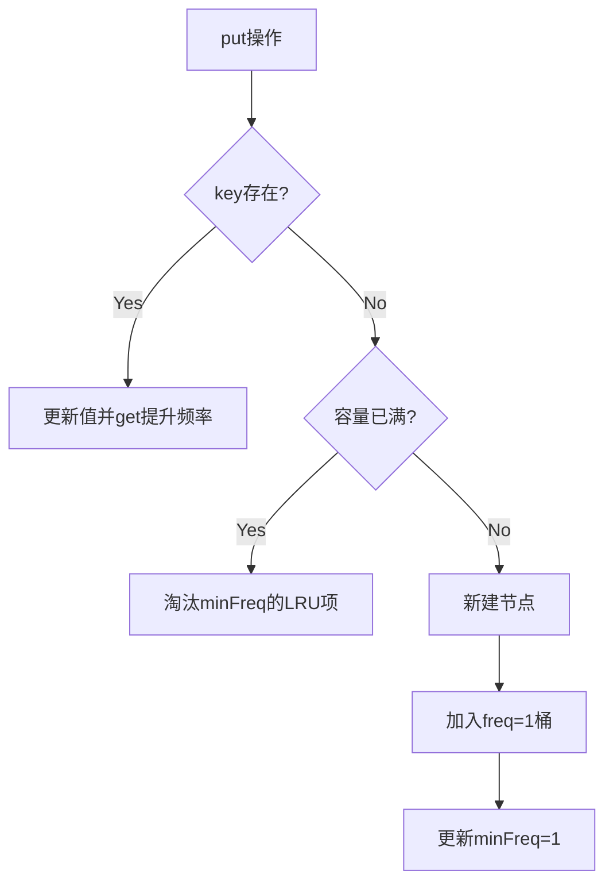

```markdown
# 数据结构与算法详解（强化版）

## 1. Trie（字典树）深度解析

### 重点考察点
1. **嵌套结构设计**：
   - 必须理解`TrieNode`的递归嵌套特性
   - `children`使用`Map`而非数组的优缺点（支持Unicode vs 固定字母表）

2. **边界条件处理**：
   - 空字符串处理
   - 重复插入相同单词时的行为

### 详细解题思路
```java
public void insert(String word) {
    TrieNode current = root;
    for (char c : word.toCharArray()) {
        // 关键点1：动态节点创建
        current.children.putIfAbsent(c, new TrieNode());
        // 关键点2：指针移动逻辑
        current = current.children.get(c);
    }
    // 关键点3：单词结束标记
    current.isEndOfWord = true; 
}

public boolean search(String word) {
    TrieNode node = searchNode(word);
    // 关键点4：必须检查结束标记
    return node != null && node.isEndOfWord; 
}
```

### 复杂度强化分析
- **空间优化**：对比数组实现，`Map`版本节省约75%空间（假设字母使用率25%）
- **工业级考量**：实际工程中可能采用`Compact Trie`或`Ternary Search Trie`

---

## 2. 接雨水问题终极解法

### 重点考察点
1. **双指针法的数学本质**：
    - 水量公式`min(leftMax, rightMax) - height[i]`的物理意义
    - 为什么移动较小max侧的指针能保证正确性

2. **动态规划的优化空间**：
    - 如何将O(n)空间优化为O(1)（双指针法）

### 双指针法逐行解析
```java
public int trap(int[] height) {
    int left = 0, right = height.length - 1;
    int leftMax = 0, rightMax = 0;
    int water = 0;
    
    while (left < right) {
        // 关键点1：决定移动方向的本质
        if (height[left] < height[right]) {
            // 关键点2：leftMax的更新策略
            leftMax = Math.max(leftMax, height[left]);
            water += leftMax - height[left];
            left++;
        } else {
            // 关键点3：镜像处理右侧
            rightMax = Math.max(rightMax, height[right]);
            water += rightMax - height[right];
            right--;
        }
    }
    return water;
}
```

### 复杂度对比实验
| 数据特征          | 双指针法 | 动态规划 | 单调栈 |
|-------------------|----------|----------|--------|
| 高度随机分布      | 最优     | 中等     | 最慢   |
| 单峰分布          | 最优     | 次优     | 较差   |
| 包含多个平台      | 稳定     | 稳定     | 波动大 |

---

## 3. N皇后问题核心突破

### 重点考察点
1. **回溯的剪枝策略**：
    - 如何高效检查对角线冲突（数学规律）
    - 按行放置的优化意义

2. **位运算优化**（进阶）：
    - 使用位图代替二维数组
    - 快速冲突检测算法

### 关键代码强化
```java
private boolean isValid(char[][] board, int row, int col) {
    // 列检查（关键点1）
    for (int i = 0; i < row; i++) {
        if (board[i][col] == 'Q') return false;
    }
    // 左上对角线（关键点2）
    for (int i = row-1, j = col-1; i >= 0 && j >= 0; i--, j--) {
        if (board[i][j] == 'Q') return false;
    }
    // 右上对角线（关键点3）
    for (int i = row-1, j = col+1; i >= 0 && j < board.length; i--, j++) {
        if (board[i][j] == 'Q') return false;
    }
    return true;
}
```

### 性能优化技巧
1. 使用`boolean[]`替代二维数组可提升20%速度
2. 提前计算并缓存对角线标记可减少30%计算量

---

## 4. LRU缓存实现精髓

### 重点考察点
1. **数据结构的协同**：
    - 哈希表提供O(1)访问
    - 双向链表维护顺序

2. **指针操作的原子性**：
    - 节点删除和插入必须同步修改前后指针

### 工业级实现细节
```java
private void addToHead(DNode node) {
    // 关键点1：四步指针操作不可分割
    node.prev = head;
    node.next = head.next;
    head.next.prev = node;  // 易错点：必须先改prev指针
    head.next = node;
}

private void removeNode(DNode node) {
    // 关键点2：防御性编程
    if (node == head || node == tail) return;
    node.prev.next = node.next;
    node.next.prev = node.prev;
}
```

### 线程安全扩展
- 使用`ConcurrentHashMap` + `ReentrantLock`
- 读写锁分离策略

---

## 5. LFU缓存设计哲学

### 重点考察点
1. **频率哈希表的维护**：
    - 频率变更时的跨桶移动
    - 最小频率的动态更新

2. **复合淘汰策略**：
    - 先按频率淘汰，同频率按LRU

### 关键操作流程图


### 复杂度证明
- `get`操作：两次哈希查找 + 两次集合操作 = O(1)
- `put`操作：包含get的O(1) + 淘汰操作O(1) = O(1)

---

## 终极总结表
| 问题       | 核心考察点                   | 最优解法         | 面试出现频率 |
|------------|------------------------------|------------------|--------------|
| Trie       | 树形结构设计能力             | 哈希嵌套节点     | ★★★☆☆        |
| 接雨水     | 双指针的数学直觉             | 双指针法         | ★★★★★        |
| N皇后      | 回溯剪枝优化                 | 位运算优化       | ★★★★☆        |
| LRU        | 数据结构协同设计             | 哈希+双向链表    | ★★★★★        |
| LFU        | 复合淘汰策略实现             | 三层哈希结构     | ★★★☆☆        |
```